# 금쪼기

> 소비습관 개선을 위한 챌린지를 통해 금융상품을 리워드로 제공하는 서비스


# 📜 목차

- [서비스 개요](#서비스-개요)
- [주요 기능](#주요-기능)
- [기술 스택](#기술-스택)
- [아키텍처 구성](#아키텍처-구성)
- [폴더 구조](#폴더-구조)
- [팀원 소개](#팀원-소개)

# 📝서비스 개요

소비습관 개선을 위한 챌린지를 통해 금융상품을 리워드로 제공하는 서비스

### 페르소나

**충동적인 소비습관을 가진 이쪼기님**

- **현재 상황** :

  - 월 수입 250만원, 월 지출 240만원, 월 저축 10만원
  - 수입의 대부분이 지출로 사용되고 저축액이 상당히 적은 상태

- **문제점** :
  - 소비의 대부분이 충동적
  - 저축을 시작하고자 하지만 정보가 부족하고 습관이 형성되어 있지 않음
- **필요한 점** :
  - 금쪼기 어플의 챌린지를 통해 충동적인 소비 습관을 개선하고 다양한 금융 상품 리워드를 활용해 저축을 시작

# ⚡주요 기능

### 1. 소비

- 소비액 분석 : 이전 달 대비 소비액 증가 / 감소 시 빨간색 / 초록색으로 표시

- 카테고리별 사용량 요약 : 챌린지 카테고리별 월 누적 소비액 요약

- 소비 현황 : 월별 누적 소비액 조회, 소비 내역 리스트 조회, 조회 조건 필터링

- 상세 내역 : 상세 내역 조회 및 수정

<div class = "flex">
  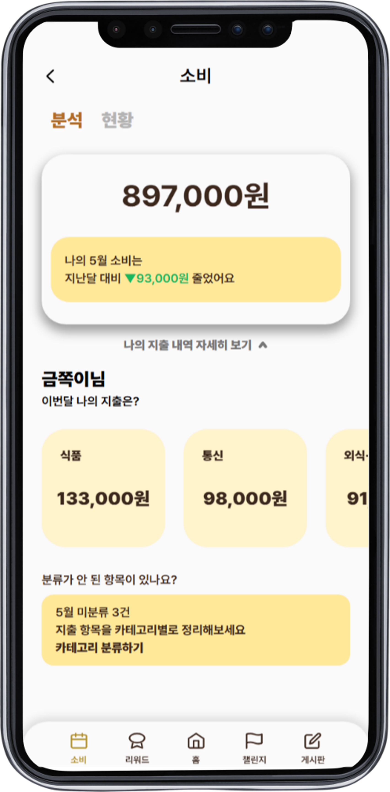
  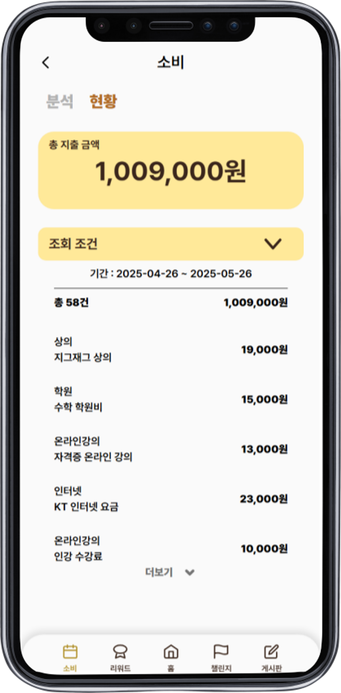
  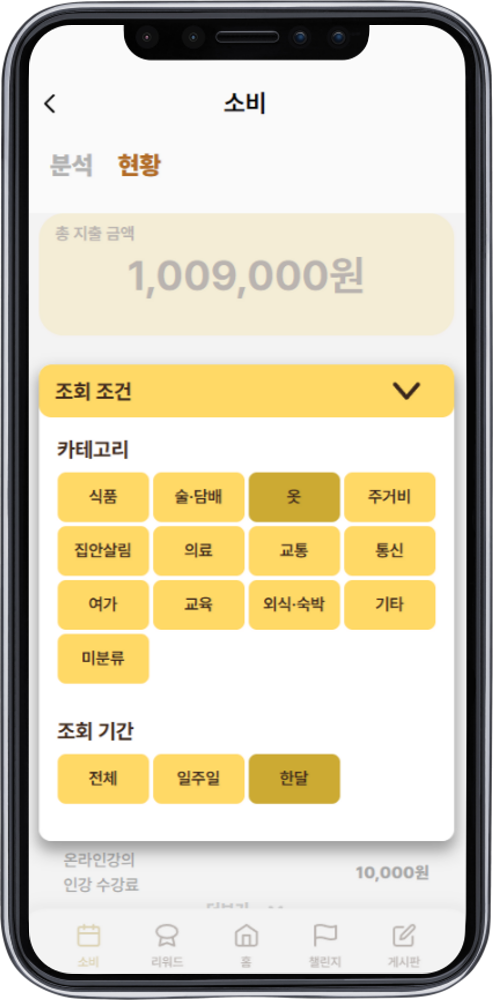
</div>

### 2. 리워드

- 상품 목록 필터링 : 전체 조회, 상품 카테고리별 조회

- 구매 내역 필터링 : 기간별 이전 구매 내역 조회, 유효기간에 따라 사용 가능, 사용 완료, 중지, 만료 구분
<div class = "flex">
  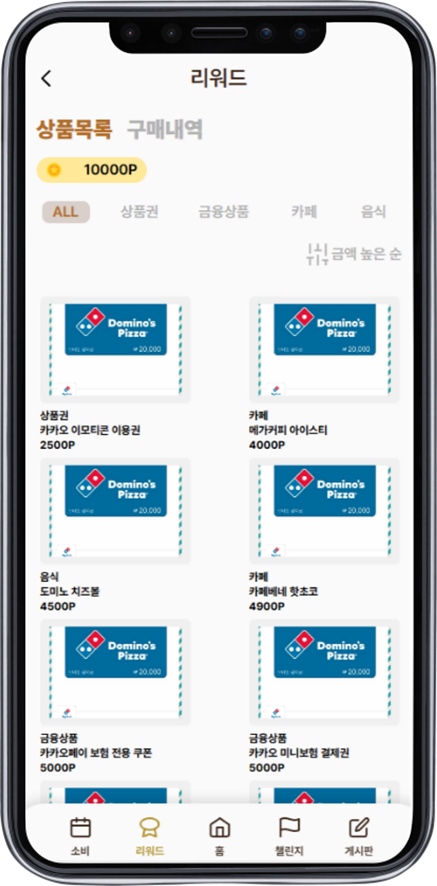
  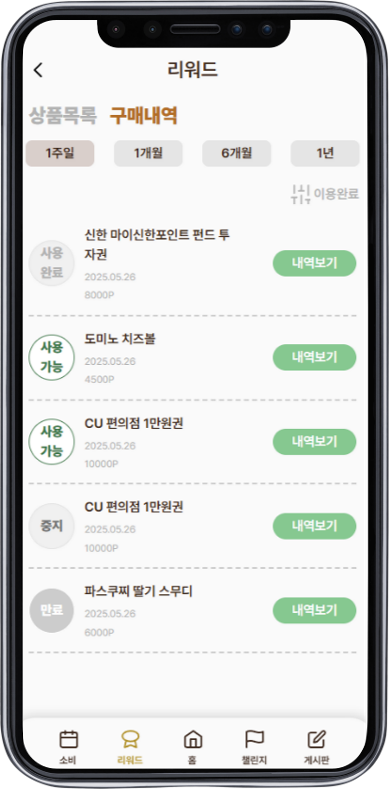
</div>

### 3. 챌린지

- 진행 중인 챌린지 : 현재 진행중인 챌린지를 카테고리, 내용, 포인트, 도전 기간 조회회

- 도전 가능한 챌린지 : 챌린지는 카테고리별 1개만 선택 가능

- 지난 챌린지 : 전체, 성공, 실패 필터링 / 실패 여부에 따라 버튼 색상 변경

<div class = "flex">
  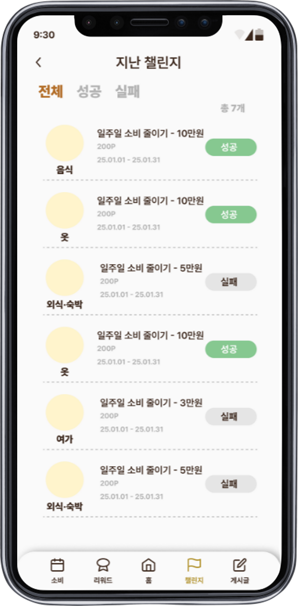
  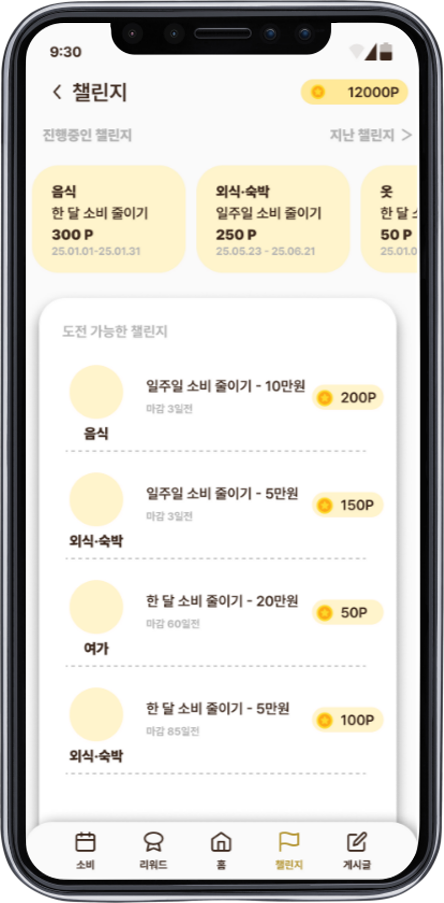
</div>

### 4. 게시글

- 전체 게시글 조회 : 게시글 목록 필터링 (최신순/ 인기순)

<div class = "flex">
  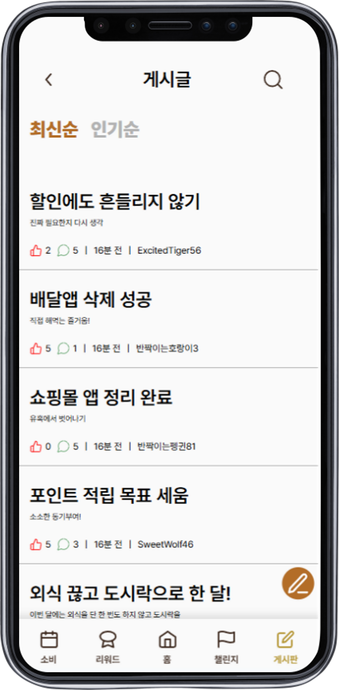
  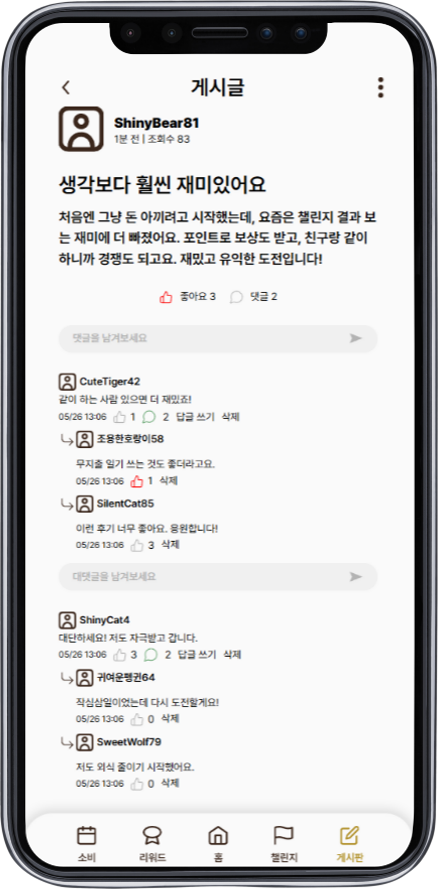
</div>

### 마이페이지

- 프로필 : 현재 보유 포인트, 월별 누적 소비금액, 도전 챌린지 수 조회

- 리워드 요약 : 교환 가능한 리워드 미리보기

- 챌린지 요약 : 도전 가능한 챌린지 목록 미리보기

  <div class = "flex">
    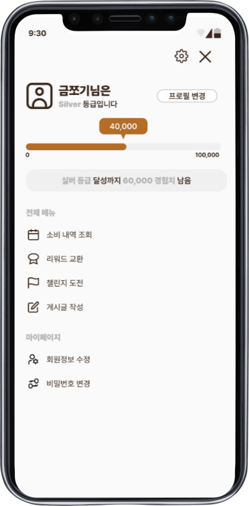
  </div>

# 🛠기술 스택

### Frontend

- Language: TypeScript
- Framework: Vue.js
- UI/스타일링: TailwindCSS
- 상태 관리: Pinia

### Backend

- Language: Python
- Framework: Django, Django REST Framework
- Database: MySQL
- 인증/보안: JWT

### Infra

- Containerization: Docker
- Cloud: AWS

# 📐아키텍처 구성

### 시스템 아키텍처

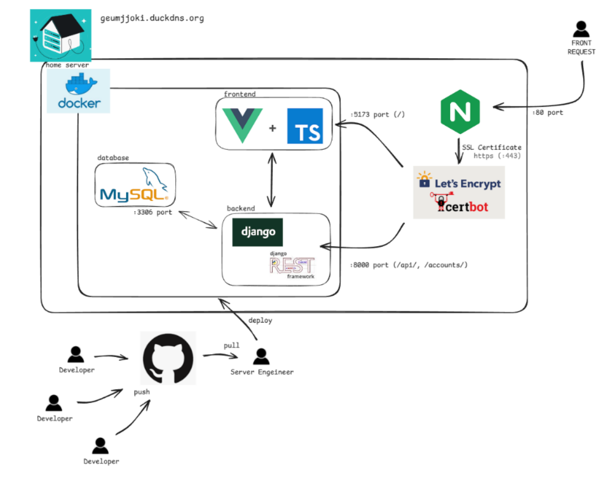

# 📂폴더 구조

```
geumjjoki/
├── front-end/                # Vue.js 기반 프론트엔드
│   ├── src/
│   │   ├── components/
│   │   ├── pages/
│   │   ├── assets/
│   │   ├── types/
│   │   ├── composables/
│   │   └── ...
│   ├── public/
│   ├── package.json
│   ├── vite.config.ts
│   ├── Dockerfile
│   └── ...
│
├── back-end/                 # Django 기반 백엔드
│   ├── accounts/
│   ├── articles/
│   ├── challenges/
│   ├── rewards/
│   ├── expenses/
│   ├── geumjjoki/
│   ├── requirements.txt
│   ├── manage.py
│   ├── Dockerfile
│   └── ...
│
├── docker-compose.yml
├── README.md
└── ...
```

# 👥팀원 소개

| 김권수   | 김정택 | 이대연 | 하재민 |
| -------- | ------ | ------ | ------ |
| BE, 팀장 | BE     | FE     | FE     |
